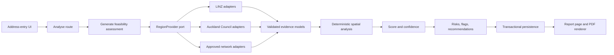

# Architecture proposal

## Decision summary

Use a modular monolith deployed as one Next.js application. Route files remain thin delivery adapters. The feasibility module owns the use case and depends on ports, not provider SDKs. Official GIS responses are converted immediately into provider-independent domain evidence. Deterministic spatial, scoring, confidence, risk, and recommendation modules consume only those internal models.

Do not add PostGIS for the POC. Store validated GeoJSON and numeric summaries in PostgreSQL JSONB/scalar columns; run the bounded, single-parcel spatial workload with Turf.js in application code. Revisit PostGIS only when national-scale querying, cross-report spatial search, large geometries, or measured runtime/memory limits justify it.

## Request flow



No arrow exists from a raw provider response directly to UI, scoring, or PDF code.

## Module boundaries

| Boundary                          | Responsibility                                                                    | Must not know about                            |
| --------------------------------- | --------------------------------------------------------------------------------- | ---------------------------------------------- |
| `app`                             | Pages, route handlers, HTTP status/error translation                              | Provider payloads or scoring internals         |
| `components`                      | Shared visual primitives and report presentation                                  | Credentials, database access, raw GIS calls    |
| `modules/feasibility/domain`      | Provider-independent models and invariants                                        | Next.js, Drizzle, ArcGIS, LINZ response shapes |
| `modules/feasibility/application` | Use-case orchestration and explicit failure handling                              | Concrete provider clients                      |
| `modules/feasibility/ports`       | Region, repository, clock, rate-limit, PDF, and narrative contracts               | Adapter implementation details                 |
| `modules/providers`               | Official-service clients, response validation, CRS conversion, provenance capture | UI, score weights, report prose                |
| `modules/spatial`                 | Geometry validation, difference/intersection/distance, placement, ranking         | Auckland dataset naming or HTTP                |
| `modules/scoring`                 | Central deterministic category rules and result bands                             | AI or raw provider formats                     |
| `modules/recommendations`         | Critical flags, risks, ordered actions, deterministic fallback narrative          | Map rendering or provider credentials          |
| `modules/reporting`               | Three-page view model, HTML/PDF rendering, attribution placement                  | Live GIS calls during rendering                |
| `db`                              | Drizzle schema, migrations, transactional repositories                            | GIS provider logic                             |
| `shared`                          | Server config, errors, logging, retry/timeout, safe HTTP client                   | Domain decisions                               |

## Proposed directory structure

```text
pool-feasibility-nz/
├── docs/
├── drizzle/
├── famiglia/geomap-intial/
├── public/
├── scripts/
│   └── data-access-spike/
├── src/
│   ├── app/
│   │   ├── (marketing)/page.tsx
│   │   ├── report/[id]/page.tsx
│   │   └── api/feasibility/
│   │       ├── analyse/route.ts
│   │       └── [id]/
│   │           ├── route.ts
│   │           └── pdf/route.ts
│   ├── components/
│   │   ├── map/
│   │   ├── report/
│   │   └── ui/
│   ├── config/
│   ├── db/
│   │   ├── migrations/
│   │   ├── repositories/
│   │   └── schema.ts
│   ├── modules/
│   │   ├── feasibility/
│   │   │   ├── application/
│   │   │   ├── domain/
│   │   │   └── ports/
│   │   ├── providers/
│   │   │   ├── auckland-council/
│   │   │   ├── linz/
│   │   │   └── shared/
│   │   ├── regions/
│   │   │   ├── auckland/
│   │   │   └── region-provider.ts
│   │   ├── recommendations/
│   │   ├── reporting/
│   │   ├── scoring/
│   │   └── spatial/
│   ├── shared/
│   │   ├── errors/
│   │   ├── geojson/
│   │   ├── http/
│   │   └── observability/
│   └── env.ts
└── tests/
    ├── e2e/
    ├── fixtures/providers/
    ├── integration/
    └── unit/
```

Directories are created when their owning vertical slice starts; the tree above is the approved target, not evidence that those modules already exist.

## Domain and evidence rules

Every material finding carries a `DatasetEvidence` record containing provider, dataset, dataset identifier, retrieval timestamp, dataset date when published, licence, attribution, geometry or attribute used, evidence type, and confidence. Provider adapters validate response size and schema before conversion. Invalid or unavailable data becomes explicit unavailable evidence, never an empty result interpreted as absence.

Store and render geometry in WGS84 GeoJSON for interoperability. Stage 2 must document each source CRS and prove the transformation path. Metric placement/area operations must use a documented local projection or a tested Turf-compatible method; coordinate-order and unit invariants require dedicated tests.

## Error contract

Application failures use stable codes: `ADDRESS_NOT_FOUND`, `ADDRESS_AMBIGUOUS`, `PARCEL_NOT_FOUND`, `OUTSIDE_SUPPORTED_REGION`, `REQUIRED_DATA_UNAVAILABLE`, `DATA_PROVIDER_ERROR`, `ANALYSIS_FAILED`, and `REPORT_GENERATION_FAILED`. Route handlers map them to safe HTTP responses and correlation IDs. Provider URLs, keys, raw payloads, stack traces, and internal database errors are never returned.

## Environment boundary

Required when the corresponding adapter is enabled:

| Variable                                      | Exposure               | Purpose                                             |
| --------------------------------------------- | ---------------------- | --------------------------------------------------- |
| `DATABASE_URL`                                | Server only            | PostgreSQL/Neon connection                          |
| `APP_BASE_URL`                                | Server only            | Absolute report/PDF URL generation                  |
| `LINZ_DATA_SERVICE_API_KEY`                   | Server only            | LINZ data queries if Stage 2 confirms the endpoint  |
| `LINZ_BASEMAPS_API_KEY`                       | Server only by default | Aerial configuration; public delivery is unresolved |
| `AUCKLAND_COUNCIL_API_KEY`                    | Server only            | Only if an approved service requires it             |
| `UPSTASH_REDIS_REST_URL/TOKEN`                | Server only            | Distributed rate limit/cache if selected            |
| `BLOB_READ_WRITE_TOKEN`                       | Server only            | Durable generated-PDF storage if selected           |
| `AI_PROVIDER`, `OPENAI_API_KEY`               | Server only, optional  | Constrained narrative enhancement                   |
| `PROVIDER_TIMEOUT_MS`, `PROVIDER_RETRY_COUNT` | Server only            | Bounded provider behavior                           |
| `ANALYSIS_VERSION`, `LOG_LEVEL`               | Server only            | Reproducibility and observability                   |

No credential receives a `NEXT_PUBLIC_` name in Stage 1.

## Runtime and operational design

- One analysis request receives an idempotency key and creates one pending report.
- Provider calls use allow-listed base URLs, response-size limits, timeouts, conservative retries, and per-provider concurrency limits.
- Stable licence-permitted responses may be cached by provider/dataset/feature identifier and version/date.
- Persistence occurs transactionally after analysis; partial provider evidence is retained only when the report can honestly complete with reduced confidence.
- Structured logs use report ID and dataset identifier, not full user-entered addresses unless explicitly redacted/hashed policy permits it.
- PDF rendering consumes the saved assessment snapshot; it never re-queries live GIS data.

## Architecture decisions still gated

1. Exact official endpoints, licences, query parameters, and attribution text.
2. Address-to-parcel algorithm and the authoritative discriminator for `42A` versus `42`.
3. Aerial style/tile delivery that preserves licensing and server-only credentials.
4. Metric CRS/transformation library after source CRS discovery.
5. HTML-to-PDF runtime (Playwright, a Vercel-compatible Chromium package, or an external renderer) after a deployment spike.
6. Whether report PDFs need durable blob storage or can be generated on demand.
7. Distributed rate-limit/cache provider.
