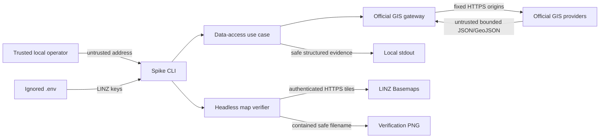

# Threat model — Job 01 official data-access spike

- Mode: retrofit
- Date: 2026-07-16
- Reviewed HEAD: `ddbf30b9dcaa2e6105fd185eb189c7441f0bdf5e`
- Reviewed state: current uncommitted remediated Job 01 working tree

## Trust flow

## STRIDE assessment

| Threat                             | Asset                        | Mitigation                                                                                     | Residual risk                                               |
| ---------------------------------- | ---------------------------- | ---------------------------------------------------------------------------------------------- | ----------------------------------------------------------- |
| Spoofed/wrong property             | Parcel identity              | Exact match, Auckland check, point-to-parcel lookup, ambiguity fail-closed, comparison parcels | Low; title/unit review remains a declared domain limitation |
| Provider identifier path traversal | Local files                  | Numeric 1–20 digit identifier and resolved-path containment                                    | Low                                                         |
| Oversized remote response          | Process memory               | Content-length precheck, streaming hard stop/cancel, timeout, two-megabyte maximum             | Low                                                         |
| Oversized/invalid geometry         | Spatial engine               | WGS84 ranges, feature/ring/vertex limits, Zod rejection                                        | Low                                                         |
| API key disclosure                 | Credentials                  | Ignored env, safe errors, no result field, zero-value-hit scan                                 | Low; LINZ requires the key in TLS query URLs                |
| SSRF                               | Network boundary             | Fixed catalogue and origin allow-list; no caller-supplied URL seam                             | Low                                                         |
| Query/HTML injection               | Provider query and local map | Parsed numeric address, doubled ArcGIS quotes, URLSearchParams, HTML encoding                  | Low                                                         |
| Dependency exploit                 | Build/runtime integrity      | Patched PostCSS override, zero production audit findings                                       | Low watch item for non-shipped Drizzle Kit loader only      |
| Excess address retention           | Privacy                      | Generic screenshots ignored; only approved fixture retainable                                  | Low; operator cleanup remains procedural                    |
| Privilege escalation               | Host                         | No auth roles, database, shell execution, or privileged service                                | N/A beyond the local operator account                       |

No unmitigated High, Critical, or applicable failing threat remains in Job 01.
