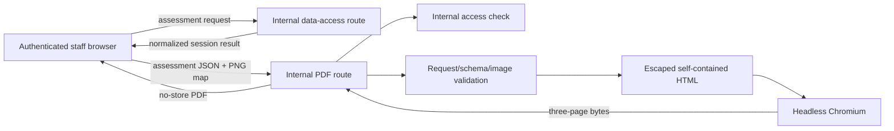

# Threat model - expandable-assessment-pdf

## Flow and boundaries

Trust boundaries are browser-to-route, route-to-renderer, and the wider Next.js process boundary containing server-only credentials. There is no report datastore and the renderer must make no provider calls.

## STRIDE analysis

| ID  | STRIDE                 | Asset                           | Attack                                                                                                            | Existing mitigation                                                                                        | Residual risk                                                                                          | Rank                         |
| --- | ---------------------- | ------------------------------- | ----------------------------------------------------------------------------------------------------------------- | ---------------------------------------------------------------------------------------------------------- | ------------------------------------------------------------------------------------------------------ | ---------------------------- |
| T1  | Spoofing               | Staff-only report access        | Call PDF route without valid staff identity                                                                       | Proxy and route both call constant-time Basic-auth check; production fails closed when credentials missing | No role granularity; development bypass trusts URL hostname and is safe only when bound locally        | Medium                       |
| T2  | Tampering              | Report integrity                | Authenticated caller changes address, score, findings, provenance, or limitations in submitted JSON               | Only shallow shape checks; HTML escaping prevents markup execution but not factual alteration              | Server currently cannot prove report matches the issued assessment                                     | **High - unmitigated**       |
| T3  | Repudiation            | Security operations             | Caller denies repeated or failed report attempts                                                                  | Correlation ID returned                                                                                    | No report outcome/security event logging                                                               | Medium                       |
| T4  | Information disclosure | Residential data and secrets    | Error response/log reveals submitted data, stack, paths, or credentials                                           | Safe generic errors, no raw logging observed, no-store, server-only environment names                      | Browser test artifacts can contain fixture addresses; operational logging requirement remains unproved | Low/Medium                   |
| T5  | Denial of service      | Next.js host                    | Repeated bounded requests launch many Chromium processes; crafted nested content inflates HTML/layout work        | 6.5 MB body cap and 6 MB data-URL length cap                                                               | No renderer timeout, rate limit, concurrency cap, or deep field/array bounds                           | **High - unmitigated**       |
| T6  | Elevation of privilege | Server process/credentials      | Inject active HTML or remote resource into renderer                                                               | Report strings are escaped; map must start as PNG data URL                                                 | Map base64/signature is not validated; renderer network access is not explicitly blocked               | Medium                       |
| T7  | Tampering              | Evidence/licence classification | Promote `spike_only` or `internal_reference` datasets in client-submitted provenance                              | Existing assessment builder classifies evidence before it reaches browser                                  | PDF route trusts the retransmitted provenance and can be called directly                               | High (same root cause as T2) |
| T8  | Information disclosure | Browser/session data            | Cache or persist report request/PDF                                                                               | Route sets no-store; feature documents no persistence                                                      | No durable server write found; local downloaded PDF retention is user-controlled                       | Low                          |
| T9  | Denial of service      | Parser/renderer                 | Malformed base64, huge strings, invalid dates, or unexpected nested values trigger errors or expensive processing | Raw body limit; catch maps errors to safe response                                                         | Shallow validator permits unbounded nested structures and type confusion before rendering              | High                         |
| T10 | Spoofing/Tampering     | Correlation/audit trail         | Inject personal data or control characters through correlation ID                                                 | Strict 1-100 safe-character allow-list                                                                     | Low                                                                                                    |

## Required abuse tests

- Unauthenticated, wrong-credential, and misconfigured-auth requests fail closed.
- Tampered report facts are rejected before renderer launch.
- Missing, malformed, non-PNG, invalid-base64, and oversized map inputs are rejected.
- Injection strings are escaped and cannot trigger requests from Chromium.
- Deep/oversized arrays and strings are rejected by schema bounds.
- Concurrent/slow render attempts are bounded and return a safe failure.
- Renderer failure does not leak stack/path/input and preserves `no-store`.

## Current threat verdict

T2/T7 (report integrity) and T5/T9 (renderer/resource exhaustion) are high and presently unmitigated. They block a Secure SDLC PASS until remediated or the PDF is explicitly redesigned as an untrusted client-authored artifact with a different user-facing contract.
