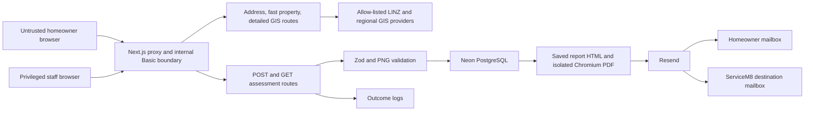

# Threat model - MT-242

## Actual data flow and trust boundaries

The browser, all request data, provider responses, email-provider responses, and stored legacy
rows are untrusted. The app/database, app/GIS, app/Chromium, app/Resend, and development/production
environment boundaries are security-relevant.

## STRIDE threats and mitigations

| ID  | STRIDE                              | Asset and attack                                                                                                                                              | Existing mitigation                                                                                                                                    | Residual risk                                                                                                                                                                                                       | Rank                                          |
| --- | ----------------------------------- | ------------------------------------------------------------------------------------------------------------------------------------------------------------- | ------------------------------------------------------------------------------------------------------------------------------------------------------ | ------------------------------------------------------------------------------------------------------------------------------------------------------------------------------------------------------------------- | --------------------------------------------- |
| T1  | Tampering                           | Directly submit invented address evidence, pool geometry, `no_warning` state, recommendations, consent time, or report content and have it persisted/emailed. | Deep Zod bounds and cross-field warning-state equality.                                                                                                | The server authenticates only shape, not truth or linkage to a server-derived assessment. A fully self-consistent forgery passes.                                                                                   | High                                          |
| T2  | Spoofing / elevation                | Force-browse staff lists, detail, or PDFs without the intended boundary.                                                                                      | App-wide proxy uses constant-time Basic credential comparison; staff handlers fail closed outside `development`/`test`; report uses a UUID path.       | Loopback development deliberately bypasses auth; non-loopback development relies on shared Basic credentials; no per-object/role authorization exists. Safe only inside the declared isolated development boundary. | High if exposed; Low in isolated local target |
| T3  | Information disclosure              | Enumerate IDs, inspect responses, browser state, logs, traces, screenshots, or generated files to obtain PII/property imagery.                                | UUID IDs, `no-store` API/report responses, safe error shapes, outcome-only delivery log, no obvious browser persistence.                               | No complete E2E artifact/leakage proof; staff detail returns full contact data; shared staff boundary has full-record access.                                                                                       | High                                          |
| T4  | Denial of service                   | Flood provider calls, 6.5 MB submissions, PostgreSQL writes, PNG validation, Chromium PDF generation, or two outbound emails per unique key.                  | Request/image/geometry bounds, provider timeouts/limits, one-process PDF busy guard, email timeout, idempotency.                                       | No route rate limit, anti-automation, per-principal quota, or durable PDF queue; attacker with boundary access can vary keys and incur cost.                                                                        | High                                          |
| T5  | Repudiation                         | Dispute consent, submission time, staff access, or disclosure because the browser supplies consent facts and reads are not audited.                           | Consent is required by schema; delivery attempts and correlation IDs are recorded.                                                                     | Consent version/timestamp are client-controlled; no staff-read/security-denial audit trail or operational breach alerting.                                                                                          | High                                          |
| T6  | Information disclosure / compliance | Send contact/property data and PDF to external processors or ServiceM8 without adequate notice or cross-border safeguards.                                    | Explicit checkbox for saving/follow-up; server-only email credentials; fixed Resend endpoint.                                                          | Notice omits forwarding/processors/retention; processing region and comparable safeguards are undocumented.                                                                                                         | High                                          |
| T7  | Injection                           | Store HTML/script/header/URL/SQL-shaped values and trigger them in staff UI, email, PDF, database, or provider requests.                                      | React escaping, `escapeHtml`, parameterized Drizzle queries, strict schemas, fixed Resend URL, GIS allow-list, PNG validation, Chromium network abort. | URL scheme policy for stored source links is not explicit; browser/API probes are incomplete.                                                                                                                       | Medium                                        |
| T8  | Software/data integrity             | Dependency or migration compromise changes assessment behavior or leaks secrets.                                                                              | Lockfile, typed migrations, schema constraints, repository review workflow.                                                                            | Fresh npm production audit is blocked because dependency metadata cannot be sent externally; candidate is a mixed uncommitted tree, so evidence cannot bind to an immutable commit.                                 | High until evidenced                          |
| T9  | Tampering / business logic          | Replay or race submissions/delivery to create duplicate records or emails.                                                                                    | Unique idempotency key, conflict recovery, per-channel claim tokens, stale-claim recovery, deterministic Resend idempotency keys.                      | Real-boundary concurrency/persistence E2E is unavailable without an isolated database and email adapter.                                                                                                            | Medium / blocked evidence                     |
| T10 | Information disclosure              | Persist data indefinitely, preventing reliable deletion, access, correction, or breach scoping.                                                               | Archived column and development-only warning document.                                                                                                 | No archive/delete UI or API, retention expiry, subject access/correction path, or documented deletion execution.                                                                                                    | High                                          |
| T11 | SSRF / resource loading             | Inject a remote URL into a report or provider input so the server/Chromium fetches it.                                                                        | Provider origin allow-list; report map accepts validated PNG data URLs; Chromium aborts every network request.                                         | Stored source URLs are rendered as anchors but not fetched during PDF generation; keep explicit scheme policy and regression coverage.                                                                              | Low                                           |
| T12 | Security misconfiguration           | Run `next dev` on a reachable host and treat its no-auth loopback or development-only staff behavior as production-ready.                                     | Production handlers fail closed; proxy requires credentials outside loopback; documentation says development only.                                     | Environment mistakes remain dangerous; no deploy-time release gate proves production hardening, TLS, headers, or retention.                                                                                         | High                                          |

## Material abuse cases mapped to tests

- T1: Submit a valid, self-consistent forged `no_warning` assessment and require server rejection.
- T2/T3: Anonymous, wrong-credential, direct staff URL/API, arbitrary-object ID, and report reads
  disclose no record or PII outside the isolated development boundary.
- T4: Oversized and malformed payloads fail before database/PDF/email work; repeated unique
  submissions encounter an observable abuse control.
- T5/T6: Consent version/time and disclosure are server-authenticated and visible before submit;
  outbound processor destinations match the notice.
- T7/T11: Injection-shaped fields are encoded, unsafe URLs cannot execute or fetch, malformed
  geometry/PNG/path inputs are rejected, and errors contain no input, stack, or secret.
- T9: same-key retry/race yields one record/reference and at most one delivery per channel.
- T10/T12: production-shaped startup denies development-only staff/data behavior and an isolated
  database fixture can be deleted or expired according to policy.

## Highest residual risks

T1, T4, T5/T6, T8, T10, and T12 are release blockers. T1 is an observed implementation failure;
T4, T5/T6, and T10 are explicitly acknowledged gaps; T8 and the strict E2E parts of T9 are blocked
by the mixed uncommitted candidate and missing isolated database/email fixture.
