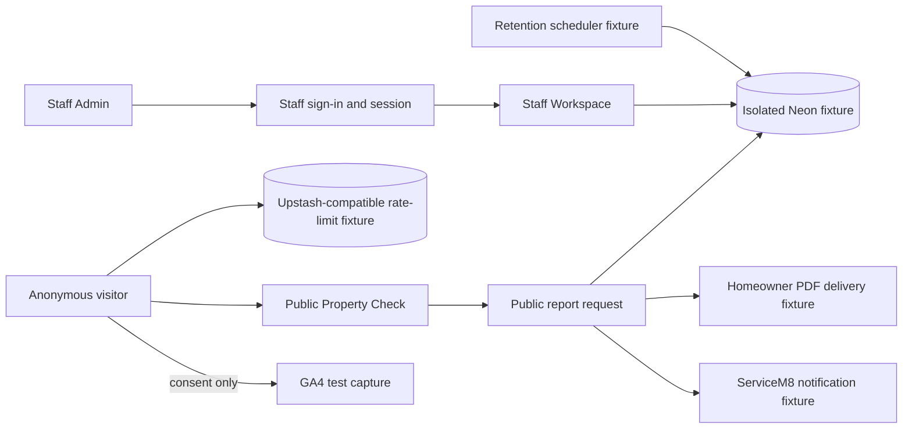

# Threat model - MT-260 traffic launch

| ID         | STRIDE                               | Asset / attack                                                                        | Implemented mitigation                                                                                              | Residual release risk                                                                                       |
| ---------- | ------------------------------------ | ------------------------------------------------------------------------------------- | ------------------------------------------------------------------------------------------------------------------- | ----------------------------------------------------------------------------------------------------------- |
| T-MT260-01 | Spoofing / elevation                 | Anonymous caller reaches Staff list/detail/API/report records.                        | Explicit public/Admin route policy, server-side session checks, HttpOnly SameSite cookie, safe sign-in redirect.    | High until forced browsing is proven through a production-build isolated lane.                              |
| T-MT260-02 | Spoofing / DoS                       | Password guessing, session replay, expired/revoked token reuse.                       | Salted scrypt hash, non-enumerating failure, five-failure lockout, eight-hour server expiry, sign-out invalidation. | High until the real database-backed fixture account is exercised.                                           |
| T-MT260-03 | DoS                                  | Automated public traffic exhausts GIS, database, PDF, or delivery capacity.           | Upstash sliding windows; production fails closed without valid managed-store configuration; privacy-safe outcomes.  | High until a real isolated distributed store proves boundary, denial, and reset behavior with zero retries. |
| T-MT260-04 | Information disclosure               | Full report, map, token, provider payload, or excess property data reaches ServiceM8. | Explicit allowlisted ServiceM8 payload; PDF attachment only for homeowner; separate delivery claims.                | High until dedicated captures inspect real outbound payloads.                                               |
| T-MT260-05 | Information disclosure / repudiation | PII persists beyond 12 months or deletion cannot be audited safely.                   | Transactional 12-month deletion, active-delivery exclusion, PII-free run record, idempotent run ID.                 | High until disposable isolated rows are created and deleted through the scheduled boundary.                 |
| T-MT260-06 | Information disclosure               | Analytics loads without consent or receives address/contact/report fields.            | Consent-gated script, reversible choice, event-name/value allowlist, extra-field rejection, safe disabled state.    | Medium until browser/network capture proves absence and payload shape in the production build.              |
| T-MT260-07 | Tampering                            | Browser forges checked property/report evidence or replays submission.                | Short-lived signed snapshot, server reconstruction, schema bounds, idempotency key.                                 | Medium until strict API/browser persistence proof exists.                                                   |
| T-MT260-08 | Repudiation / disclosure             | Security evidence itself contains sessions, secrets, customer data, or stale claims.  | Evidence references commit and safe key states only; ignored runtime artifacts; validator-backed structure.         | High while the strict execution report, traces, and isolated fixture version are missing.                   |
