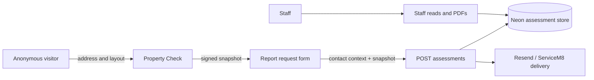

# Threat model - public-lead-capture

| ID | STRIDE | Asset / attack | Current mitigation | Residual risk |
| --- | --- | --- | --- | --- |
| T-PLC-01 | Spoofing / elevation | An anonymous visitor reaches the global proxy outside loopback. | Proxy denies access unless shared Basic credentials are configured. | **High:** this prevents the intended public journey and shared Basic is not staff identity. |
| T-PLC-02 | Tampering | Caller changes checked address/evidence or report content. | Signed snapshot is verified; server builds the persisted aggregate and sources the address from it. | Medium until real-boundary E2E proves forgery rejection. |
| T-PLC-03 | Tampering / DoS | Caller selects Other without meaningful context, sends malformed or huge content, or replays snapshots. | Zod bounds, 6.5 MB body cap, conditional Other validation, snapshot expiry, unique idempotency key. | Medium: no public rate limit, CSRF/origin policy, or E2E evidence. |
| T-PLC-04 | Information disclosure | Personal/property data leaks through public staff routes, URLs, logs, browser storage, or analytics. | `no-store` responses; safe delivery failure log uses reference/correlation. | **High:** shared dev boundary, no public analytics implementation proof, and no real leakage test. |
| T-PLC-05 | Repudiation | Consent/disclosure cannot be shown or delivery actions cannot be traced. | Consent boolean/version/time and channel delivery states persist. | **High:** notice and lifecycle controls are incomplete; broader privacy-safe audit trail is absent. |
| T-PLC-06 | DoS | Automated traffic exhausts GIS, database, Chromium, or email capacity. | Payload/time bounds and delivery idempotency. | **High:** rate limiting/quota/queue are not implemented. |
| T-PLC-07 | Access control | Staff reads arbitrary lead IDs or PDFs. | Development-only checks and proxy Basic exist; UUID validation for PDF. | **High:** no individual identity, role, or per-record policy for production. |
